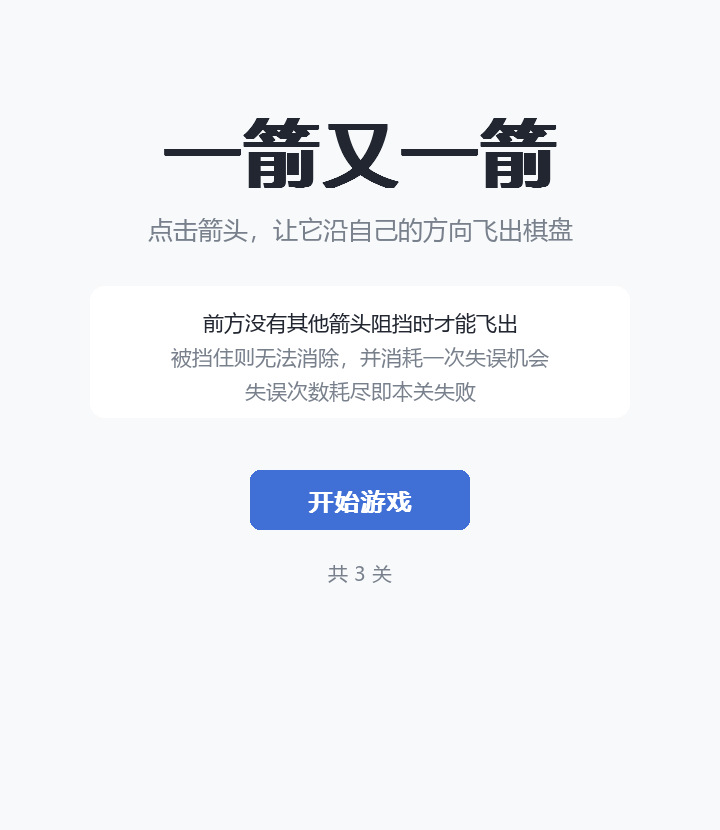
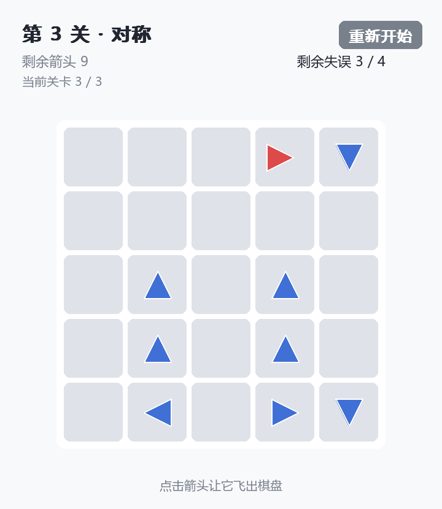
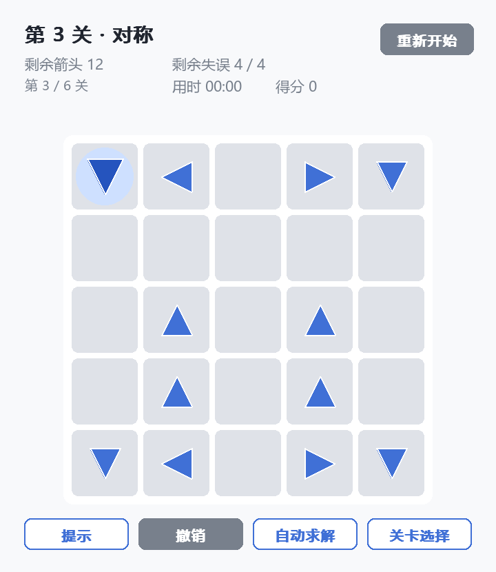
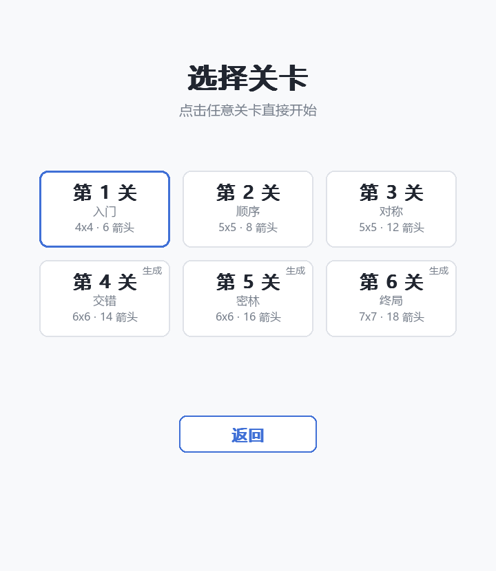
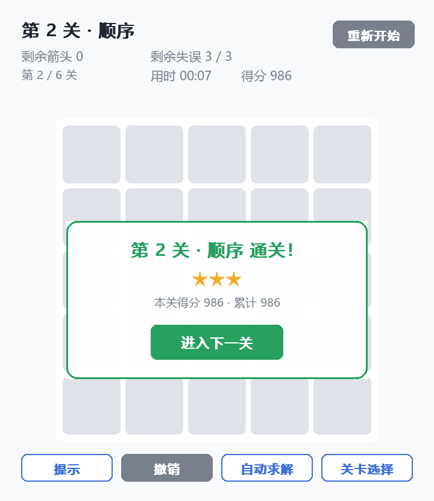
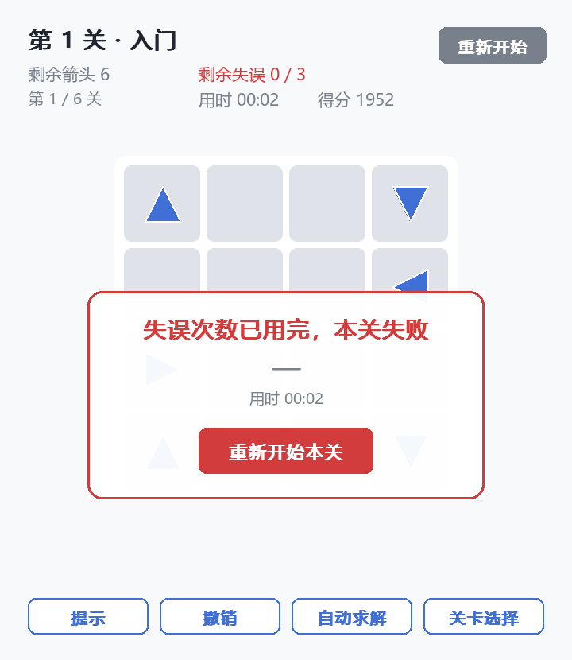
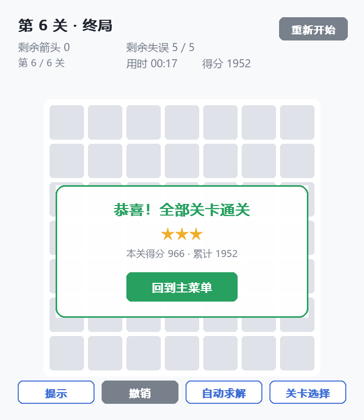
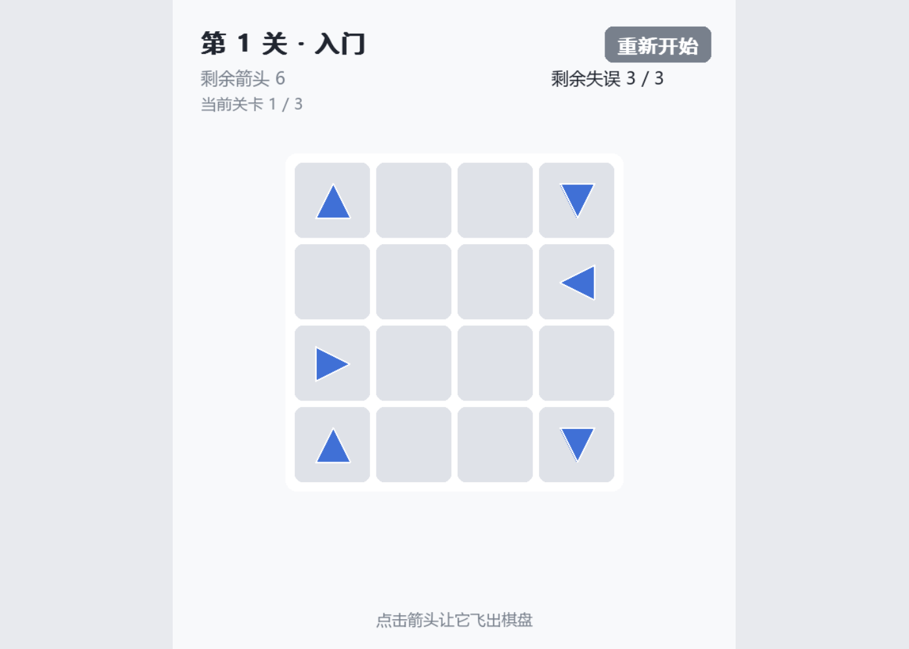

# 一箭又一箭（arrow-path-game）

一个用 Python + Pygame 实现的网格箭头解谜小游戏。玩家观察箭头方向与相互阻挡关系，
按合适的顺序点击箭头，使所有箭头依次飞出棋盘。

> 本项目为福州大学《H202601 软件工程与软件工程实践》第二次个人作业，
> 开发过程中使用了 AIGC 工具辅助。需求文档见 [PRD.md](PRD.md)，测试记录见 [test.md](test.md)。

---

## 1. 项目名称

**一箭又一箭（arrow-path-game）**

| 项目 | 内容 |
| --- | --- |
| 项目名称 | 一箭又一箭 / arrow-path-game |
| 仓库地址 | https://github.com/slantingbell/arrow-path-game |
| 开发语言 | Python |
| 图形库 | Pygame（pygame-ce） |
| 作业名称 | 2026 秋软件工程个人作业（第二次）——利用 AIGC 完成"一箭又一箭"小游戏 |
| 参考玩法 | 微信小游戏《一箭又一箭》的核心玩法（未使用其素材、代码或关卡） |

---

## 2. 游戏简介

棋盘由若干格子组成，每个格子里有一个带方向的箭头（上 / 下 / 左 / 右），或者为空。
点击一个箭头，程序会检查它前进方向上的路径：

- 如果箭头与棋盘边界之间**没有其他箭头阻挡**，该箭头飞出棋盘并被消除；
- 如果路径上**存在其他箭头**，该箭头不能被消除，会晃动并变红作为碰撞提示，
  同时**消耗一次失误机会**；
- 清除本关全部箭头即可进入下一关；
- 失误次数耗尽时本关失败，可以重新开始。

例如下面这一行，第一个箭头朝右，但右侧仍有其他箭头，因此不能飞出：

```text
→  ·  ·  ↑  ·
```

而这一行最后一个箭头朝右，右侧没有其他箭头，因此可以飞出：

```text
↑  ·  ·  ·  →
```

界面包含**开始界面**、**关卡选择**、**游戏界面**和**通关 / 失败界面**。
鼠标移到箭头上时箭头会放大并高亮，给出"这一格可以点"的反馈。

### 关卡

游戏共 **6 关**，难度递增：

| 关卡 | 棋盘 | 箭头数 | 初始被阻挡 | 失误上限 |
| --- | :-: | :-: | :-: | :-: |
| 第 1 关 · 入门 | 4×4 | 6 | 2 | 3 |
| 第 2 关 · 顺序 | 5×5 | 8 | 4 | 3 |
| 第 3 关 · 对称 | 5×5 | 12 | 10 | 4 |
| 第 4 关 · 交错 | 6×6 | 14 | 9 | 4 |
| 第 5 关 · 密林 | 6×6 | 16 | 8 | 4 |
| 第 6 关 · 终局 | 7×7 | 18 | 10 | 5 |

每一关都已验证**零失误可通关**，不存在无解的死锁布局。除固定关卡外，
游戏还能随机生成保证可通关的关卡，详见下文第 7 节。

---

## 3. 开发环境

| 项目 | 版本 / 说明 |
| --- | --- |
| 操作系统 | Windows 11 Pro（10.0.26200），代码同时兼容 macOS / Linux |
| Python | 3.14.5 |
| pygame-ce | 2.5.8（SDL 2.32.10） |
| numpy | 2.4.6（音效合成用，随 pygame-ce 一并安装） |
| 测试框架 | Python 标准库 `unittest`，无需额外安装 |
| PyInstaller | 6.22.3（仅在打包为可执行文件时用到） |

界面使用 pygame-ce（Pygame 的社区维护分支，`import pygame` 的用法与 Pygame 完全一致）。
中文文字使用操作系统自带字体，按平台依次回退，仓库中不包含字体文件。

---

## 4. 安装和运行方法

### 4.1 获取代码

```bash
git clone https://github.com/slantingbell/arrow-path-game.git
cd arrow-path-game
```

### 4.2 安装依赖

推荐使用虚拟环境：

```bash
python -m venv .venv

# Windows
.venv\Scripts\activate
# macOS / Linux
source .venv/bin/activate
```

安装依赖：

```bash
pip install -r requirements.txt
```

`requirements.txt` 只有一个运行依赖：`pygame-ce>=2.5.0`。

### 4.3 运行游戏

```bash
python main.py
```

### 4.4 运行测试（可选）

```bash
python -m unittest discover -s tests -t .
```

在没有显示设备的机器（例如远程终端）上，可先设置无头驱动：

```bash
# Windows
set SDL_VIDEODRIVER=dummy
# macOS / Linux
export SDL_VIDEODRIVER=dummy
```

### 4.5 打包为可执行文件（可选）

```bash
pip install pyinstaller
python build_exe.py
```

产物在 `dist/` 目录下（Windows 为 `一箭又一箭.exe`）。打包后可执行文件支持自检：

```bash
./dist/一箭又一箭.exe --selftest report.txt
```

---

## 5. 游戏操作说明

| 操作 | 说明 |
| --- | --- |
| **鼠标左键** | 点击箭头，尝试让它飞出棋盘 |
| **鼠标左键** | 点击右上角"重新开始"按钮，将当前关卡恢复到初始状态 |
| **鼠标左键** | 开始界面点"开始游戏"开始新游戏；有存档时可点"继续游戏" |
| **移动鼠标** | 悬停在箭头上时箭头放大高亮，光标变为手型 |
| **H 键 / 提示按钮** | 高亮一个当前可以安全飞出的箭头 |
| **Z 键 / 撤销按钮** | 撤销上一步（失败后也能撤销，可把致命一步撤回来） |
| **A 键 / 自动求解** | 自动逐步通关当前关卡，再按一次停止 |
| **L 键 / 关卡选择** | 打开关卡选择界面，任意跳关 |
| **拖拽窗口边缘** | 自由缩放窗口，画面自动等比缩放并居中 |
| **鼠标滚轮** | 缩放画面（在"适应窗口"的基础上再放大 / 缩小） |
| **+ / - 键** | 放大 / 缩小画面 |
| **0 键** | 恢复为"适应窗口"大小 |
| **R 键** | 游戏中快速重新开始当前关卡 |
| **ESC 键** | 退出游戏（退出前自动存档） |

> 界面切换只响应按钮上的点击，点击其它位置不会误触发。

---

## 6. 游戏截图

### 开始界面



### 游戏界面

显示当前关卡、棋盘、剩余箭头数量、剩余失误次数、本关用时与累计得分，
以及"重新开始"按钮和底部四个工具按钮（提示 / 撤销 / 自动求解 / 关卡选择）。



### 悬停反馈

鼠标移到箭头上时，箭头放大并亮起蓝色光晕，与橙色的"提示"高亮明确区分。



### 关卡选择



### 通关界面



### 失败界面



### 全部通关



### 窗口缩放

拖拽窗口边缘或使用滚轮即可自由缩放，画面等比缩放并在比例不符时居中留白。



> 以上截图由 `tools/capture_screens.py` 驱动真实游戏画面生成，与实际运行效果一致。

---

## 7. 附加功能

在完成上述基础要求的前提下，额外实现了以下扩展功能：

| 功能 | 说明 |
| --- | --- |
| **更多关卡与关卡选择** | 6 个关卡，可在选关界面任意跳转，卡片上显示棋盘尺寸与箭头数 |
| **随机关卡生成** | `generator.py` 能生成**保证可通关**的随机关卡，不会被死锁卡住 |
| **提示** | 高亮一个当前可安全飞出的箭头，2.5 秒后自动淡出 |
| **撤销上一步** | 基于点击前快照回退；失败后也能撤销，可把致命一步撤回来 |
| **计时与星级评价** | 记录本关用时，按失误与用时计分，零失误 3 星 |
| **自动求解** | 自动逐步通关当前关卡，可随时停止 |
| **进度存档** | 通关与退出时自动存档，菜单出现"继续游戏"；读档会校验是否被篡改 |
| **音效** | 7 种音效，全部由代码合成（扫频、琶音、包络），无音频设备时自动静音 |
| **打包为可执行文件** | `build_exe.py` 一键打包成单文件 exe，附 `--selftest` 自检 |

### 随机关卡生成的可通关性

生成器采用**逆序放置**，而不是"先生成再筛选"：

> 放置第 k 个箭头时，要求它沿自身方向的路径上不含任何已放置的箭头。

于是把这些箭头按放置的**逆序**移除时，第 k 个箭头在轮到它时，棋盘上只剩下在它
之前放置的那些箭头，而它们都不在它的路径上，所以它必定可以飞出。
可解性由构造本身保证，不需要事后用求解器反复筛选。

---

## 8. 项目结构

```text
├── main.py                  图形界面与程序入口（pygame）
├── game.py                  核心游戏逻辑：棋盘、方向、路径检测、状态流转
├── levels.py                关卡数据与关卡校验
├── generator.py             随机关卡生成（保证可通关）
├── audio.py                 程序化音效
├── storage.py               进度存档读写
├── build_exe.py             打包为可执行文件
├── requirements.txt         运行依赖
├── README.md                本文件
├── PRD.md                   需求文档
├── test.md                  测试记录
├── tests/
│   ├── test_game.py         核心逻辑单元测试
│   ├── test_app.py          T01–T06 界面自动化测试
│   └── test_features.py     附加功能测试
├── tools/
│   └── capture_screens.py   生成 README 用的界面截图
└── docs/screenshots/        界面截图
```

`game.py` 不导入任何图形库，因此游戏规则可以脱离界面单独测试；
`main.py` 只负责绘制与把点击翻译成 `Game.click()` 调用。

---

## 9. 测试

共 **177 个自动化测试用例**，全部通过：

```text
Ran 177 tests in 13.2s

OK
```

- `tests/test_game.py`（63 个）：方向解析、路径检测、边界越界、失误次数、状态流转、
  关卡校验、提示、撤销、计分星级、计时、存档数据；
- `tests/test_app.py`（64 个）：通过模拟鼠标点击驱动真实界面，逐条覆盖作业要求的
  T01–T06，以及界面切换不误触、窗口缩放后的坐标换算、鼠标悬停反馈、界面元素不重叠；
- `tests/test_features.py`（50 个）：关卡生成器、存档读写、音效降级、关卡选择、
  提示与撤销按钮、自动求解、得分显示、读档继续、快捷键、打包自检。

测试借助 SDL 的 dummy 视频驱动，**无需显示设备和人工操作**即可完整运行。
详细的测试项目、预期结果、实际结果以及测试过程中发现的缺陷，见 [test.md](test.md)。

---

## 10. 素材来源说明

本项目未使用任何第三方美术素材、音效或关卡数据：

- 界面全部由代码绘制（矩形、三角形、文字）；
- 箭头用 `pygame.draw.polygon` 绘制；
- 音效由 `audio.py` 用 numpy 合成正弦波、扫频与琶音，仓库中不含音频文件；
- 中文文字使用操作系统自带字体（Windows 的微软雅黑 / 黑体，macOS 的苹方，
  Linux 的文泉驿或 Noto Sans CJK），按平台依次回退，仓库中不包含字体文件；
- 关卡布局为本项目自行设计或由自研生成器产出，全部经过可通关性校验。

---

## 11. 相关文档

| 文件 | 内容 |
| --- | --- |
| [PRD.md](PRD.md) | 需求文档：功能需求、界面需求、评分标准、里程碑 |
| [test.md](test.md) | 测试记录：T01–T06 结果、缺陷记录、变异测试 |
